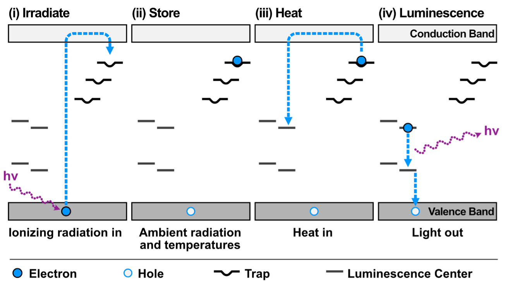

# Thermoluminescence (TL)

## Introduction

Thermoluminescence (TL) is a form of luminescence that occurs when a material emits light upon being heated. This phenomenon is commonly used in archaeological dating, geology, and materials science. TL can provide insights into the thermal history of a sample and its exposure to radiation over time.

## Basics of Thermoluminescence

### TL Build-Up

Thermoluminescence build-up occurs when a material is exposed to ionizing radiation, such as sunlight or cosmic rays. The energy from this radiation is absorbed by the material and stored in the form of trapped electrons within defects in the crystal lattice. Over time, these electrons accumulate, and the material builds up a latent luminescence signal.

The rate at which electrons are promoted to traps can be described by a first order rate equation such as:

$$\frac{dn}{dt} = \alpha (N - n) R$$

where $n$ is the number of trapped electrons, $N$ is the total number of available traps, and $R$ is the dose rate, $t$ is time, and $\alpha$ is a rate constant for electrons filling available traps, which can be determined experimentally from the growth curve of TL intensity versus dose.

### TL Decay

When the material is subsequently heated, the trapped electrons gain enough energy to escape from their traps. As they recombine with holes in the crystal lattice, they release the stored energy in the form of visible light. This emission of light is the thermoluminescence signal. The intensity of the emitted light is proportional to the number of trapped electrons, which correlates with the amount of radiation the material has been exposed to.
	
The decay of the thermoluminescence signal can be described by the following equation:

$$
\frac{dn}{dt} = -n s \exp \left( \frac{E}{kT} \right)
$$

where $\frac{dn}{dt}$ is the rate of change of the number of trapped electrons over time, $s$ is the frequency factor, which is a material-specific constant, $E$ is the activation energy required for the electrons to escape from their traps, $k$ is Boltzmann's constant, $T$ is the absolute temperature, and $\exp \left( \frac{E}{kT} \right)$ is the exponential term describing the probability of the trapped electrons gaining enough energy to escape.

<em> 
Fig. 1.  Band model for thermoluminescence.  The passage of ionizing radiation through the crystal (usually feldspar in lunar samples) promotes electrons to traps (impurity or intrinsic defects) a few eV in energy below the conduction band.  Heat causes the electrons to return to the conduction band where some fraction returns to the ground state through luminescence centers (usually a transition element impurity). For example, Mn sitting in a Ca site in the lattice can cause both traps (by lattice distortion) and luminescence centers (via d-d transitions in the Mn). </em>

### Combined TL Equation

The overall thermoluminescence process can also be described by combining the build-up and decay processes into a more comprehensive equation. The general TL intensity as a function of heating temperature can be expressed as:

$$I = \frac{n_0^2 s}{N} \exp \left( -\frac{E}{kT} \right) \left[ 1 + \frac{n_0 s}{N \beta} \int \exp \left( -\frac{E}{kT} \right) dT \right]^{-2}$$

Where all the variables are as previously defined.

## Applications

Thermoluminescence is widely used in various fields such as:
- **Archaeology**: Dating ceramic materials and sediments.
- **Radiation Dosimetry**: Measurements of radiation doses
- **Geology**: Understanding the thermal history of rocks and minerals.
- **Material Science**: Studying defects and properties of materials.

Thermoluminescence continues to be a powerful tool for researchers in unraveling the past and understanding the properties of materials.

# TL of Lunar Regolith Samples

## Background
Lunar regolith is the fine dusty material that covers the lunar surface. Probably one of the most famous images in history is the bootprint of the first astronaut, Neil Armstrong, in lunar regolith.
Lunar regolith is composed of many different minerals. One of the most abundant minerals is feldspar, a usually white-colored mineral, that is also highly luminescent. The TL of feldspar can provide information about the thermal and radiation history of the lunar surface. Moreover, due to the variability in the TL signal measured, the method also can tell us about what type of feldspar is present and as such tell us under what condition this mineral has formed in the first place, which i important to understand the geologic history of the Moon.

## The TL of the Apollo 17 Samples from the Taurus-Littrow Valley on the Moon

Most of my work so far on lunar samples has been on Apollo 17 samples that were collected duirng the last manned mission to the Moon at the Taurus-Littrow Valley. 

<em> 
Fig. 2 TL glow curves (black line) for samples in different illumination conditions and temperature environments. (a) is for regolith taken in sunlight near the deep drill core drill site, while (b) is for regolith taken from regolith deep in the shadow of the Boulder 4 at Station 6.  The difference in the thermal conditions inside the boulder shadow and sunlit surface is clearly apparent. (c) Glow curve after a dose of ~135 Gy of 90Sr beta radiation. Shaded areas underneath glow curve corresponds to individual peaks listed in Table 1. Gray lines represent the sum of individual curves. TL intensity is given in thousand counts per second (cps). Data and surface temperature estimates derived from natural TL are from Sears et al. (2024). </em>

---

